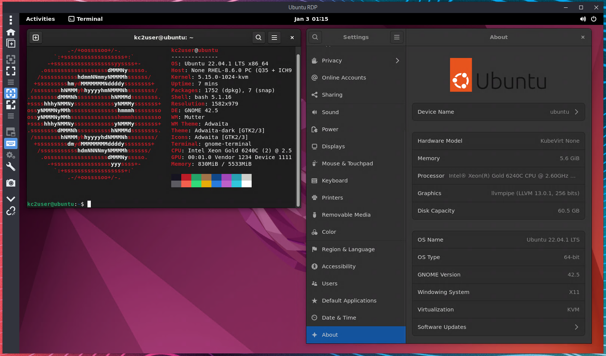

# Install [Ubuntu Server 22.04 LTS]
[Ubuntu Server 22.04 LTS]:https://releases.ubuntu.com/kinetic/ubuntu-22.10-live-server-amd64.iso

### 1. Download & Write Ubuntu ISO to USB
  - [From Linux](https://www.youtube.com/watch?v=BCeG2JMuCpU)
  - [From MacOS](https://www.youtube.com/watch?v=f78AwZk3IXs)
  - [From Windows](https://www.youtube.com/watch?v=42vjjlhtufs)
    
    #### Or via Linux Terminal:
    ```bash
    sudo dd if=~/Downloads/$UBUNTU_ISO of=/dev/sdX conv=sync status=progress
    ```    
    >  ##### * Where sdX is the name of your usb drive as seen in `~$ lsblk`
    >  ##### **Be sure the USB is completely written before unpluging

### 2. [Install Ubuntu]() (Video Coming Soon)
### 3. Create Host Bridge br0 as primary interface
  - each node should have a `br0` linux bridge interface
  - each node's `br0` interface should be the only default interface
  - each node's `br0` interface should be configured with a static address

  ```bash
  vim /etc/netplan/$YOUR_NETPLAN_CONFIG.yaml
  ```

  ```yaml
  # Exammple Netplan br0 configuration
  network:
  version: 2
  ethernets:
    enp1s0:
      dhcp4: false
      dhcp6: false
  bridges:
    br0:
      interfaces:
      - enp1s0
      dhcp4: false
      dhcp6: false
      addresses:
      - 192.168.1.77/16
      routes:
      - to: default
        via: 192.168.1.1
      nameservers:
        addresses:
        - 192.168.1.9
        search:
        - home.arpa
  ```

### 4. Add Intel IOMMU Configurations to grub kernel boot arguments
  ```bash
  # Open grub configuration file /etc/default/grub
  vim /etc/default/grub

  # Append these three arguments to the GRUB_CMDLINE_LINUX_DEFAULT line
  GRUB_CMDLINE_LINUX_DEFAULT="intel_iommu=on iommu=pt pci=realloc"

  # Update grub
  sudo update-grub
  ```

### 5. Install Packages

  * QEMU KVM and Libvirt

  ```bash
  sudo apt install -y libvirt-daemon-system libvirt-daemon qemu-kvm
  sudo systemctl enable --now libvirtd
  ```

  * Snap Packages

  ```bash
  sudo snap install --classic microk8s
  sudo snap install --classic helm
  sudo snap install --classic kubectl
  sudo microk8s enable community
  ```

  * [`virtctl`](https://github.com/kubevirt/kubevirt/releases)
  ```sh
  export VIRTCTL_RELEASE=$(curl -s https://api.github.com/repos/kubevirt/kubevirt/releases/latest | awk -F '["v,]' '/tag_name/{print $5}')
  sudo curl --output /usr/local/bin/virtctl -L https://github.com/kubevirt/kubevirt/releases/download/v${VIRTCTL_RELEASE}/virtctl-v${VIRTCTL_RELEASE}-$(uname -s | awk '{print tolower($0)}')-amd64
  sudo chmod +x /usr/local/bin/virtctl
  virtctl version --client
  ```

### 6. Configure first microk8s instance

  ```bash
  mkdir ~/.kube
  sudo chown -f -R $USER ~/.kube
  sudo usermod -a -G microk8s $USER
  sudo microk8s config > ~/.kube/config
  chmod 600 ~/.kube/config
  sudo shutdown -r now
  ```

### 7. Add qemu-kvm binary permissions to apparmor for kubevirt

  ```bash
  # Open apparmor profile /etc/apparmor.d/usr.sbin.libvirtd
  sudo vim /etc/apparmor.d/usr.sbin.libvirtd

  # Add this line following the libvirtd configuration
  # aprox. Line 97
  /usr/{lib,lib64,lib/qemu,libexec}/qemu-kvm PUx,

  # Load the new apparmor profile
  sudo apparmor_parser -r /etc/apparmor.d/usr.sbin.libvirtd
  ```

### 8. Configure first microk8s instance

  ```bash
  # Enable a few microk8s plugins
  sudo microk8s enable hostpath-storage dns multus cert-manager metrics-server observability

  # Check for all running pods
  kubectl get po -A
  ```

### 9. Install Kubevirt

  ```bash
  # Get latest release version
  export RELEASE=$(curl https://storage.googleapis.com/kubevirt-prow/release/kubevirt/kubevirt/stable.txt)

  # Install Kubevirt Operator
  kubectl apply -f https://github.com/kubevirt/kubevirt/releases/download/${RELEASE}/kubevirt-operator.yaml
  
  # Install Kubevirt Custom Resources
  kubectl apply -f https://github.com/kubevirt/kubevirt/releases/download/${RELEASE}/kubevirt-cr.yaml
  ```

### 10. Install Containerized Data Importer

  ```bash
  # Get latest release version
  export TAG=$(curl -s -w %{redirect_url} https://github.com/kubevirt/containerized-data-importer/releases/latest)
export VERSION=$(echo ${TAG##*/})

# Install CDI Operator
kubectl create -f https://github.com/kubevirt/containerized-data-importer/releases/download/$VERSION/cdi-operator.yaml

# Install CDI Custom Resources
kubectl create -f https://github.com/kubevirt/containerized-data-importer/releases/download/$VERSION/cdi-cr.yaml
  ```

### 11. Create br0 multus network attachment definition

  > NOTE: This network attachment definition will connect VMs to the br0 interface connected to your physical LAN

  ```bash
  cat <<EOF | kubectl apply -f -
  apiVersion: k8s.cni.cncf.io/v1
  kind: NetworkAttachmentDefinition
  metadata:
    name: nadbr0
    namespace: default
  spec:
    config: {"cniVersion":"0.3.1","name":"br0","plugins":[{"type":"bridge","bridge":"br0","ipam":{}},{"type":"tuning"}]}
  EOF
  ```

### 12. Create SSH Public Key Secret

  - Create Kubernetes secret with base64 encoded ssh pub key

  ```bash
  ls ~/.ssh/id_rsa.pub >/dev/null || ssh-keygen
  kubectl create secret generic kargo-sshpubkey-kc2user \
      --from-file=key1=$HOME/.ssh/id_rsa.pub \
      --dry-run=client -oyaml \
    | kubectl apply -f -
  ```

  - Verify secret contents

  ```sh
  kubectl get secret -oyaml kargo-sshpubkey-kc2user | awk '/key1:/{print $2}' | base64 -d
  ```

### 13. Create an Ubuntu RDP enabled Virtual Machine

  ```bash
  # Create VM
  kubectl apply -f https://raw.githubusercontent.com/ContainerCraft/100DaysOfHomelab/main/hack/VirtualMachine/ubuntu-rdp.yaml

  # Watch VM status
  watch kubectl get vmi -owide
  ```

### 14. Access the Virtual Machine

  * Serial Console (watch boot and cloud-init progress)

  ```bash
  virtctl console ubuntu-rdp
  ```

  * SSH

  ```bash
  ssh kc2user@$(kubectl get vmi ubuntu-rdp -ojsonpath={.status.interfaces[]} | jq -r .ipAddress)
  ```

  * RDP
  
  > Access with Remmina RDP client on Linux, or any other RDP client on Windows or MacOS is simple. This example VM yaml creates a username and password in the VM of `kc2user:kc2user` and IP should be listed with the `kubectl get vmi` command.



----------------------------------------------------------------

## For more VMs and images

* Kubevirt VM guest images: https://github.com/ContainerCraft/kmi
* Kubevirt VM definition examples: https://github.com/ContainerCraft/kc2

----------------------------------------------------------------

## Add a new microk8s node

### 1. Create network br0 interface

  * write br0 netplan config with static IP address

```bash
# Exammple Netplan br0 configuration
network:
version: 2
ethernets:
  enp1s0:
    dhcp4: false
    dhcp6: false
bridges:
  br0:
    interfaces:
    - enp1s0
    dhcp4: false
    dhcp6: false
    addresses:
    - 192.168.1.78/16
    routes:
    - to: default
      via: 192.168.1.1
    nameservers:
      addresses:
      - 192.168.1.9
      search:
      - home.arpa
```

  * Apply configuration

```
sudo netplan apply
```

### 2. Install microk8s

```bash
sudo snap install microk8s --classic
```

### 3. Connect node to the cluster

  * On a microk8s controlplane node (read the output from this command)

  ```bash
  microk8s add-node
  ```

  * On the new microk8s node paste the join command

  ```bash
  # for example:
  sudo microk8s join 192.168.1.77:25000/cbac6a5a1233eb63540f010af7eae0f1/faa29c94a66b
  ```

  > NOTE: allow all pods to schedule and try to run, you may need to reboot afterwards to ensure new permissions are applied to allow all pods to correctly run